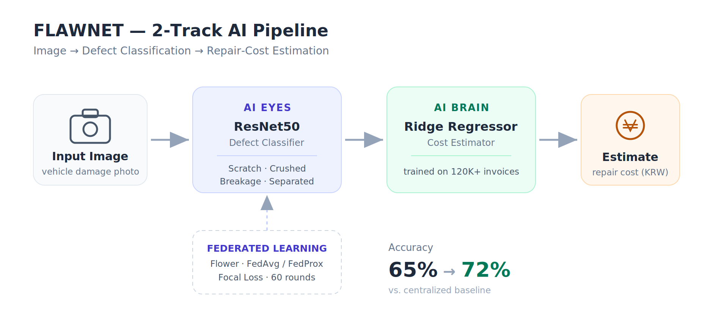
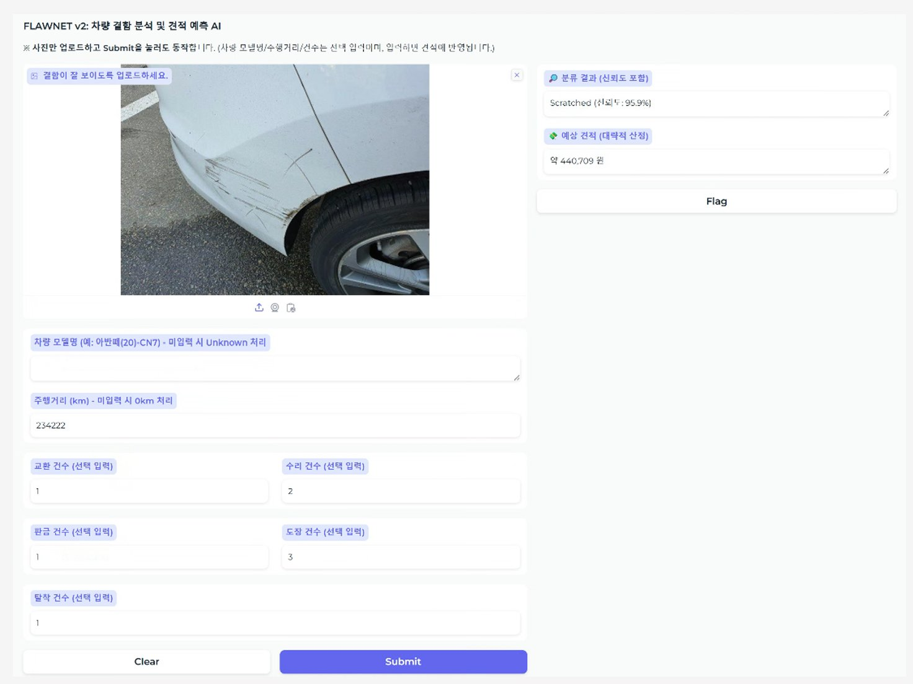

# 🚗 FLAWNET

**Federated Learning-based Vehicle Defect Analysis & Cost Estimation**

차량 손상 사진 한 장으로 **결함 종류를 분류**하고 **예상 수리비를 산정**하는 2-Track AI 파이프라인입니다.
경쟁 관계인 렌터카 운영사들이 데이터를 직접 공유하지 않고도 함께 모델을 학습할 수 있도록 **연합학습(Federated Learning)** 으로 데이터 주권을 보존하도록 설계했습니다.

> 🏆 **2025 캡스톤 디자인 경진대회 장려상 수상작** (Team Project, 2025.07 – 2025.12)

<br>



---

## 📌 Summary

- Built a **2-Track AI pipeline** (ResNet50 classifier + Ridge cost estimator) preserving data sovereignty across competing rental-car operators via **federated learning**.
- Fine-tuned a **Flower**-based FL model (**FedAvg / FedProx**) with **Focal Loss** over **60 rounds**, raising accuracy from **65% to 72%** vs. the centralized baseline.
- Developed a **Gradio** web demo for end-to-end image-to-estimate inference; awarded the **Encouragement Prize** at the Capstone Design Competition.

---

## 🖥️ Demo

이미지를 업로드하면 **AI 눈(Eyes)** 이 결함을 분류하고, **AI 뇌(Brain)** 가 약 12만 건의 견적 데이터를 기반으로 예상 수리비를 산정합니다.



---

## 🧠 Architecture

| Track | 역할 | 모델 | 출력 |
|-------|------|------|------|
| **AI Eyes (눈)** | 결함 종류 분류 | ResNet50 (전이학습 + Dropout) | Scratch / Crushed / Breakage / Separated |
| **AI Brain (뇌)** | 수리비 회귀 예측 | Ridge Regression | 예상 청구액 (원) |

- **불균형 데이터 대응**: 결함 4종의 클래스 불균형을 보정하기 위해 **Focal Loss + 클래스 가중치**를 적용했습니다.
- **연합학습**: 운영사별 데이터를 외부로 유출하지 않고 **Flower** 프레임워크에서 **FedAvg / FedProx**로 60 라운드 학습하여, 중앙집중식 대비 정확도를 65% → 72%로 향상시켰습니다.

---

## 🛠️ Tech Stack

`Python` · `PyTorch` · `torchvision (ResNet50)` · `Flower (FL)` · `scikit-learn (Ridge)` · `Gradio` · `pandas` · `matplotlib / seaborn`

---

## 📂 Project Structure

```
FLAWNET/
├── app.py                          # Gradio 웹 데모 (눈 + 뇌 통합 추론)
├── train.py                        # ⚠️ AI 눈(ResNet50) 학습 스크립트 — 직접 추가 필요
├── evaluate.py                     # 평가 (정확도 / F1 / 혼동행렬)
├── data_diagnostics.py             # 데이터셋 분포·매핑 진단
├── check_extraction.py             # 추출 데이터 정합성 검사
├── check_defect_distribution.py    # 결함 종류 분포 확인
├── cost_estimator/                 # AI 뇌(견적 예측) 파이프라인
│   ├── 1_data_preparation.py       #   견적서 JSON → 학습용 CSV 변환
│   ├── 2_model_training.py         #   Ridge 모델 학습 → model_brain.pkl
│   └── 3_predict_cost.py           #   견적 예측 테스트
├── assets/
│   ├── architecture.png
│   └── demo.png
├── requirements.txt
└── .gitignore
```

---

## 🚀 How to Run

```bash
# 1. 의존성 설치
pip install -r requirements.txt

# 2. (AI 뇌) 견적 데이터 준비 → 모델 학습
python cost_estimator/1_data_preparation.py
python cost_estimator/2_model_training.py

# 3. (AI 눈) 결함 분류 모델 학습 → best_model.pth 생성
python train.py

# 4. 모델 성능 평가
python evaluate.py

# 5. 웹 데모 실행
python app.py
```

---

## 📎 Notes

- **학습된 가중치(`best_model.pth`, 약 91MB)와 견적 모델(`model_brain.pkl`)** 은 용량 문제로 저장소에 포함하지 않았습니다. `train.py`와 `cost_estimator/` 스크립트를 순서대로 실행하면 직접 생성됩니다.
- **데이터셋**(차량 손상 이미지·견적서 JSON)은 AI Hub 등 원본 출처의 라이선스에 따라 포함하지 않았습니다.
- 일부 스크립트에는 로컬 절대경로(`C:\Users\...`)가 남아 있습니다. 다른 환경에서 실행하려면 상대경로로 수정하면 좋습니다.
